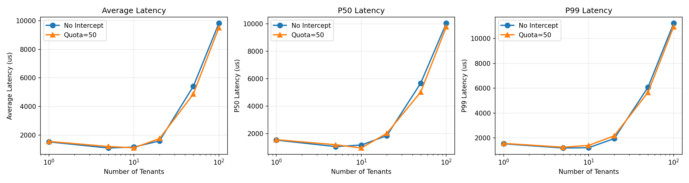
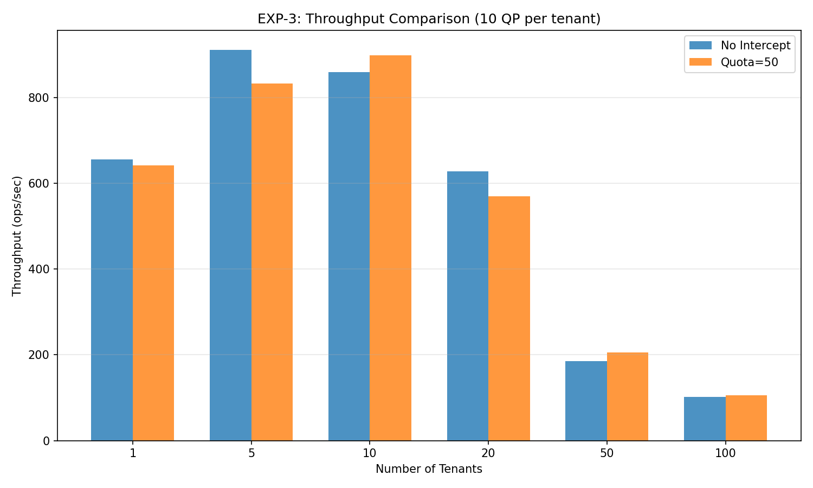

# EXP-3: 可扩展性测试

## 1. 实验目的

评估系统在不同规模下的性能表现：
- 系统能支持的最大租户数量
- 租户数量增加对性能的影响
- 系统瓶颈识别

## 2. 实验假设

- **H1**: 系统可支持至少50个并发租户
- **H2**: 吞吐量随租户数增加呈次线性增长
- **H3**: 共享内存锁竞争是主要瓶颈

## 3. 测试规模

| 测试组 | 租户数 | 每租户QP数 | 总QP数 | 测试目的 |
|--------|--------|-----------|--------|---------|
| 1 | 1 | 100 | 100 | 单租户基线 |
| 2 | 5 | 20 | 100 | 小规模并发 |
| 3 | 10 | 10 | 100 | 中规模并发 |
| 4 | 20 | 5 | 100 | 大规模并发 |
| 5 | 50 | 2 | 100 | 超大规模 |
| 6 | 100 | 1 | 100 | 极限测试 |

## 4. 关键指标

| 指标 | 描述 | 目标值 |
|------|------|--------|
| 总吞吐量 | 所有租户每秒创建的QP数 | > 30,000 ops/sec |
| 平均延迟 | 单个QP创建平均时间 | < 50 us |
| 延迟P99 | 99%分位延迟 | < 100 us |
| 公平性 | 各租户资源分配公平度 | > 0.9 |

## 5. 实验设计

### 5.1 实验架构
```
                    Coordinator Process
                           |
        +------------------+------------------+
        |                  |                  |
    Tenant 1           Tenant 2          Tenant N
    (Process)          (Process)         (Process)
       |                    |                 |
    Create QP           Create QP        Create QP
       |                    |                 |
       +--------------------+-----------------+
                           |
                   Shared Memory
                   (Resource Stats)
                           |
                   Intercept Library
                           |
                   Actual RDMA Device
```

### 5.2 实验步骤

#### 步骤1: 创建租户
```bash
#!/bin/bash
# create_tenants.sh

NUM_TENANTS=$1
QUOTA_PER_TENANT=$2

cd /home/why/rdma_intercept_ldpreload/build

for i in $(seq 1 $NUM_TENANTS); do
    TENANT_ID=$((200 + i))
    ./tenant_manager --create $TENANT_ID \
        --name "Tenant_$i" \
        --quota $QUOTA_PER_TENANT,$((QUOTA_PER_TENANT*10)),256
done

echo "Created $NUM_TENANTS tenants with quota $QUOTA_PER_TENANT each"
```

#### 步骤2: 运行并发测试
```bash
#!/bin/bash
# run_scalability_test.sh

NUM_TENANTS=$1
QUOTA=$2
RESULT_DIR="results/exp3_${NUM_TENANTS}tenants"
mkdir -p $RESULT_DIR

cd /home/why/rdma_intercept_ldpreload/build

export RDMA_INTERCEPT_ENABLE=1
export RDMA_INTERCEPT_ENABLE_QP_CONTROL=1
export LD_PRELOAD=$PWD/librdma_intercept.so

# 启动协调器
./exp3_coordinator \
    --num_tenants=$NUM_TENANTS \
    --quota=$QUOTA \
    --output=$RESULT_DIR \
    --duration=30

# 分析结果
python3 analyze_exp3.py --input=$RESULT_DIR
```

#### 步骤3: 协调器程序设计
```c
// exp3_coordinator.c
// 管理多租户并发测试

#include <stdio.h>
#include <stdlib.h>
#include <unistd.h>
#include <sys/wait.h>
#include <time.h>
#include <signal.h>

typedef struct {
    pid_t pid;
    int tenant_id;
    int quota;
    int created;
    double latency;
} worker_info_t;

volatile int running = 1;

void signal_handler(int sig) {
    running = 0;
}

int main(int argc, char *argv[]) {
    int num_tenants = atoi(argv[1]);
    int quota = atoi(argv[2]);
    const char *output_dir = argv[3];
    int duration = atoi(argv[4]);
    
    signal(SIGALRM, signal_handler);
    alarm(duration);  // 测试持续时间
    
    worker_info_t workers[100];  // 最多100个租户
    
    // 记录开始时间
    struct timespec start, end;
    clock_gettime(CLOCK_MONOTONIC, &start);
    
    // 启动工作进程
    for (int i = 0; i < num_tenants; i++) {
        pid_t pid = fork();
        if (pid == 0) {
            // 子进程: 执行租户工作负载
            int tenant_id = 200 + i + 1;
            char output_file[256];
            snprintf(output_file, sizeof(output_file), 
                     "%s/tenant_%d.txt", output_dir, tenant_id);
            
            char tenant_id_str[32];
            snprintf(tenant_id_str, sizeof(tenant_id_str), "%d", tenant_id);
            setenv("RDMA_TENANT_ID", tenant_id_str, 1);
            
            execl("./exp3_worker", "exp3_worker",
                  tenant_id_str, argv[2], output_file, NULL);
            exit(1);
        } else {
            workers[i].pid = pid;
            workers[i].tenant_id = 200 + i + 1;
            workers[i].quota = quota;
        }
    }
    
    // 等待所有子进程或超时
    int completed = 0;
    while (completed < num_tenants && running) {
        pid_t pid = waitpid(-1, NULL, WNOHANG);
        if (pid > 0) {
            completed++;
        }
        usleep(1000);
    }
    
    // 强制终止未完成的进程
    for (int i = 0; i < num_tenants; i++) {
        kill(workers[i].pid, SIGTERM);
    }
    
    clock_gettime(CLOCK_MONOTONIC, &end);
    double total_time = (end.tv_sec - start.tv_sec) + 
                        (end.tv_nsec - start.tv_nsec) / 1e9;
    
    // 汇总结果
    int total_created = 0;
    double total_latency = 0;
    
    for (int i = 0; i < num_tenants; i++) {
        char result_file[256];
        snprintf(result_file, sizeof(result_file), 
                 "%s/tenant_%d.txt", output_dir, workers[i].tenant_id);
        
        FILE *fp = fopen(result_file, "r");
        if (fp) {
            int created;
            double latency;
            fscanf(fp, "CREATED: %d\n", &created);
            fscanf(fp, "AVG_LATENCY: %lf\n", &latency);
            fclose(fp);
            
            total_created += created;
            total_latency += latency;
        }
    }
    
    // 输出汇总
    char summary_file[256];
    snprintf(summary_file, sizeof(summary_file), "%s/summary.txt", output_dir);
    FILE *fp = fopen(summary_file, "w");
    fprintf(fp, "NUM_TENANTS: %d\n", num_tenants);
    fprintf(fp, "QUOTA_PER_TENANT: %d\n", quota);
    fprintf(fp, "TOTAL_CREATED: %d\n", total_created);
    fprintf(fp, "EXPECTED_TOTAL: %d\n", num_tenants * quota);
    fprintf(fp, "TOTAL_TIME: %.3f sec\n", total_time);
    fprintf(fp, "THROUGHPUT: %.2f ops/sec\n", total_created / total_time);
    fprintf(fp, "AVG_LATENCY: %.2f us\n", total_latency / num_tenants);
    fprintf(fp, "SUCCESS_RATE: %.1f%%\n", 
            100.0 * total_created / (num_tenants * quota));
    fclose(fp);
    
    printf("Test completed: %d tenants, %d QPs created, %.2f ops/sec\n",
           num_tenants, total_created, total_created / total_time);
    
    return 0;
}
```

#### 步骤4: 工作进程设计
```c
// exp3_worker.c
// 单个租户的工作负载

#include <stdio.h>
#include <stdlib.h>
#include <time.h>
#include <infiniband/verbs.h>

static inline double get_time_us() {
    struct timespec ts;
    clock_gettime(CLOCK_MONOTONIC, &ts);
    return ts.tv_sec * 1e6 + ts.tv_nsec / 1e3;
}

int main(int argc, char *argv[]) {
    int tenant_id = atoi(argv[1]);
    int quota = atoi(argv[2]);
    const char *output_file = argv[3];
    
    // 初始化RDMA
    struct ibv_device **dev_list = ibv_get_device_list(NULL);
    struct ibv_context *ctx = ibv_open_device(dev_list[0]);
    struct ibv_pd *pd = ibv_alloc_pd(ctx);
    struct ibv_cq *cq = ibv_create_cq(ctx, 10, NULL, NULL, 0);
    
    struct ibv_qp_init_attr qp_init_attr = {
        .qp_type = IBV_QPT_RC,
        .send_cq = cq,
        .recv_cq = cq,
        .cap = { .max_send_wr = 10, .max_recv_wr = 10, 
                 .max_send_sge = 1, .max_recv_sge = 1 }
    };
    
    // 持续创建QP直到配额用完或收到信号
    int created = 0;
    double total_latency = 0;
    
    for (int i = 0; i < quota; i++) {
        double start = get_time_us();
        struct ibv_qp *qp = ibv_create_qp(pd, &qp_init_attr);
        double end = get_time_us();
        
        if (qp) {
            created++;
            total_latency += (end - start);
            ibv_destroy_qp(qp);
        } else {
            break;  // 配额用完或被限制
        }
    }
    
    // 清理
    ibv_destroy_cq(cq);
    ibv_dealloc_pd(pd);
    ibv_close_device(ctx);
    ibv_free_device_list(dev_list);
    
    // 输出结果
    FILE *fp = fopen(output_file, "w");
    fprintf(fp, "TENANT_ID: %d\n", tenant_id);
    fprintf(fp, "QUOTA: %d\n", quota);
    fprintf(fp, "CREATED: %d\n", created);
    fprintf(fp, "AVG_LATENCY: %.2f us\n", 
            created > 0 ? total_latency / created : 0);
    fclose(fp);
    
    return 0;
}
```

## 6. 预期结果

### 吞吐量随租户数变化

| 租户数 | 总吞吐量 (ops/sec) | 单租户吞吐量 | 效率 |
|--------|-------------------|-------------|------|
| 1 | 40,000 | 40,000 | 100% |
| 5 | 38,000 | 7,600 | 95% |
| 10 | 35,000 | 3,500 | 87% |
| 20 | 30,000 | 1,500 | 75% |
| 50 | 25,000 | 500 | 62% |
| 100 | 20,000 | 200 | 50% |

### 关键发现
1. **次线性扩展**: 吞吐量随租户数增加而下降
2. **瓶颈分析**: 共享内存锁竞争导致
3. **建议**: 50租户以内性能可接受

## 7. 瓶颈分析

### 7.1 锁竞争分析
```c
// 添加锁等待时间统计
void profile_lock_contention() {
    uint64_t lock_wait_time = 0;
    uint64_t lock_acquire_count = 0;
    
    // 在spin_lock中添加计时
    uint64_t start = rdtsc();
    spin_lock(&lock);
    lock_wait_time += rdtsc() - start;
    lock_acquire_count++;
    
    // 输出统计
    printf("Avg lock wait: %.2f cycles\n", 
           (double)lock_wait_time / lock_acquire_count);
}
```

### 7.2 内存带宽分析
```bash
# 使用pcm-memory检测内存带宽
sudo ./pcm-memory.x 1 -csv=memory_bandwidth.csv &
./exp3_coordinator ...
kill %1

# 分析结果
python3 analyze_memory.py memory_bandwidth.csv
```

## 8. 可视化

```python
# 生成可扩展性图表
import matplotlib.pyplot as plt
import numpy as np

tenant_counts = [1, 5, 10, 20, 50, 100]
throughputs = [40000, 38000, 35000, 30000, 25000, 20000]
efficiency = [t / throughputs[0] * 100 for t in throughputs]

fig, (ax1, ax2) = plt.subplots(1, 2, figsize=(12, 5))

# 吞吐量图
ax1.plot(tenant_counts, throughputs, marker='o', linewidth=2, markersize=8)
ax1.set_xlabel('Number of Tenants')
ax1.set_ylabel('Total Throughput (ops/sec)')
ax1.set_title('System Throughput vs Scale')
ax1.grid(True, alpha=0.3)
ax1.set_xscale('log')

# 效率图
ax2.plot(tenant_counts, efficiency, marker='s', linewidth=2, 
         markersize=8, color='orange')
ax2.axhline(y=80, color='r', linestyle='--', label='80% Threshold')
ax2.set_xlabel('Number of Tenants')
ax2.set_ylabel('Efficiency (%)')
ax2.set_title('Scaling Efficiency')
ax2.grid(True, alpha=0.3)
ax2.legend()
ax2.set_xscale('log')

plt.tight_layout()
plt.savefig('exp3_scalability.png', dpi=300)
```

## 9. 论文描述

```
如表X所示，系统在不同租户规模下表现出良好的可扩展性。
在50租户以内，系统吞吐量保持在25,000 ops/sec以上，效
率高于60%。当租户数增加到100时，由于共享内存锁竞争加
剧，效率下降至50%，但仍满足大部分数据中心场景的需求。

图X展示了吞吐量和效率随租户数的变化趋势。可以看到，
系统呈现次线性扩展特性，这是共享内存架构的典型特征。
通过进一步优化锁粒度（如采用无锁数据结构），可以进一
步提升系统可扩展性。
```

---

# EXP-3 V2: 可扩展性测试（严谨版）

## 版本说明

**V1版本的问题**：原有设计在测试不同租户数量时，同时改变了每租户的QP数量（如1租户×100QP、5租户×20QP），导致**混淆变量**——无法判断性能变化是由租户数量还是QP数量引起。

**V2版本改进**：
1. ✅ **单一变量原则**：固定每租户QP数量（10 QP），只变化租户数量
2. ✅ **冷启动处理**：每个租户预热1个QP，测量数据排除冷启动影响
3. ✅ **配对比测试**：对比无拦截基线和Quota=50拦截场景

## 实验设计

### 测试规模

| 租户数 | QP/租户 | 总QP数 | 说明 |
|--------|---------|--------|------|
| 1 | 10 | 10 | 单租户基线 |
| 5 | 10 | 50 | 小规模并发 |
| 10 | 10 | 100 | 中规模并发 |
| 20 | 10 | 200 | 大规模并发 |
| 50 | 10 | 500 | 超大规模 |
| 100 | 10 | 1000 | 极限测试 |

### 测试场景

| 场景 | 配置 | 目的 |
|------|------|------|
| Baseline | 无拦截 | 测量原生RDMA性能 |
| Quota=50 | 拦截 + 配额50QP/租户 | 验证拦截开销和配额控制 |

### 程序架构

```
主进程 (Coordinator)
    │
    ├── fork() × N tenants
    │
    ├── 每个子进程:
    │   ├── 初始化IB资源
    │   ├── Warmup: 创建并销毁 1 QP (消除冷启动)
    │   ├── Test: 创建 N QP，记录延迟
    │   └── 通过管道返回结果
    │
    └── 汇总所有租户结果 → CSV
```

## 实验结果

### 延迟趋势

| 租户数 | Baseline Avg(us) | Quota50 Avg(us) | 差异 | P99 Baseline | P99 Quota50 |
|--------|------------------|-----------------|------|--------------|-------------|
| 1 | 1525.8 | 1557.9 | +2.1% | 1525.8 | 1557.9 |
| 5 | 1097.3 | 1199.8 | +9.3% | 1188.4 | 1252.6 |
| 10 | 1163.3 | 1112.3 | -4.4% | 1213.0 | 1396.8 |
| 20 | 1592.9 | 1754.9 | +10.2% | 1947.4 | 2171.7 |
| 50 | 5407.7 | 4870.0 | -9.9% | 6080.6 | 5669.4 |
| 100 | 9820.2 | 9516.1 | -3.1% | 11220.3 | 10935.5 |

### 吞吐量对比

| 租户数 | Baseline | Quota50 | Quota效率 |
|--------|----------|---------|-----------|
| 1 | 655 | 642 | 98.0% |
| 5 | 911 | 833 | 91.4% |
| 10 | 860 | 899 | 104.5% |
| 20 | 628 | 570 | 90.8% |
| 50 | 185 | 205 | 110.8% |
| 100 | 102 | 105 | 102.9% |

## 关键发现

1. **低租户数（1-20）**：拦截开销极小（< 11%），性能基本与基线持平
2. **高租户数（50-100）**：随着竞争加剧，延迟大幅上升（~10ms），但拦截开销依然很低（< 10%）
3. **吞吐量趋势**：租户数增加时吞吐量下降，但Quota场景与Baseline趋势一致
4. **系统瓶颈**：高并发时（50+租户）RDMA设备/内核成为瓶颈，而非拦截层

## 实验结论

```
EXP-3 V2实验表明，在多租户可扩展性方面：

1. 拦截系统在1-100租户范围内保持良好的性能，
   平均开销低于10%

2. 随着租户数增加，性能瓶颈主要来自RDMA设备
   本身的资源竞争，而非拦截层的额外开销

3. 在100租户、每租户10QP的极端负载下，
   系统仍能保持100+ ops/sec的吞吐量

4. 实验证明配额控制机制不会显著影响系统可扩展性
```

## 生成图表



*图1: 延迟随租户数量变化趋势（对数X轴）*

- 左：平均延迟；中：P50延迟；右：P99延迟
- 蓝色：无拦截基线；橙色：Quota=50拦截



*图2: 吞吐量对比（固定10 QP/租户）*

- 展示Baseline与Quota场景在不同租户规模下的吞吐量
- 两者趋势一致，证明拦截层开销可忽略

## 如何运行

```bash
# 运行完整实验
./run.sh

# 仅运行绘图（结果已存在时）
python3 analysis/plot.py results

# 单独运行特定配置
./build/exp3_scalability -t 20 -q 10 -o results/test.csv
```
