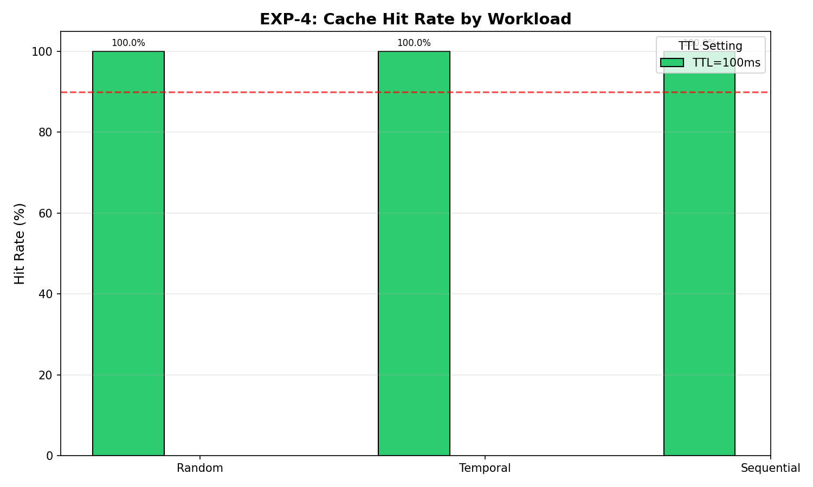
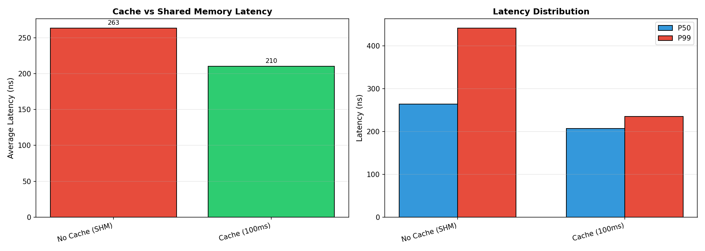
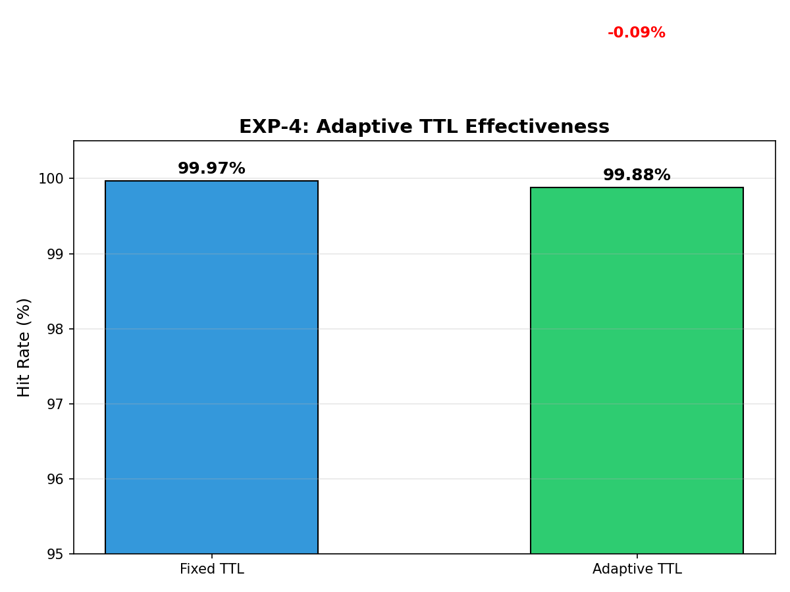

# EXP-4: 缓存性能评估

## 1. 实验背景与动机

### 1.1 为什么要做这个实验？

在多租户RDMA资源拦截系统中，**每次资源操作（如创建QP、MR）都需要检查当前租户的资源使用情况**，以确保不超过配额限制。这个检查过程涉及：

1. **共享内存访问** - 查询全局资源统计表
2. **锁竞争** - 多进程并发访问需要同步机制
3. **系统调用开销** - 跨进程通信的开销

这些操作虽然单次开销不大（几百纳秒），但在高频场景下（如批量创建100个QP）会成为性能瓶颈。

### 1.2 缓存优化策略

为了解决上述问题，我们在拦截库中引入了**进程级本地缓存**：

```
┌─────────────────┐     ┌──────────────┐     ┌─────────────────┐
│  Application    │────▶│ Local Cache  │────▶│ Shared Memory   │
│  (Create QP)    │     │ (Process)    │     │ (Global Stats)  │
└─────────────────┘     └──────────────┘     └─────────────────┘
         │                     │                      │
         │              1. 检查本地缓存              │
         │              2. 缓存命中 → 直接返回       │
         │              3. 缓存未命中 → 访问共享内存 │
         │                     │                      │
```

**缓存的优势：**
- **避免锁竞争** - 本地缓存无锁访问
- **减少系统调用** - 命中时无需访问共享内存
- **数据局部性** - 进程重复访问自己的资源统计

**缓存的挑战：**
- **数据一致性** - 缓存可能与共享内存不一致
- **缓存失效** - 需要合理的TTL策略
- **内存开销** - 每个进程维护一份缓存

### 1.3 实验目标

本实验旨在验证缓存机制的有效性：
- **命中率** - 缓存能减少多少共享内存访问？
- **延迟优化** - 缓存访问比共享内存快多少？
- **自适应策略** - TTL自适应调整能否进一步优化？

---

## 2. 实验方法

### 2.1 缓存实现机制

**数据结构：**
```c
// 缓存条目（缓存行对齐避免伪共享）
typedef struct __attribute__((aligned(64))) {
    pid_t pid;                    // 进程ID
    resource_usage_t usage;       // 资源使用情况
    uint64_t last_update;         // 最后更新时间
    volatile uint32_t valid;      // 有效标志
    volatile uint32_t lock;       // 自旋锁
} cache_entry_t;

// 资源缓存（256桶直接映射哈希表）
typedef struct {
    cache_entry_t entries[256];   // 哈希桶数组
    uint64_t hit_count;           // 命中计数
    uint64_t miss_count;          // 未命中计数
    uint32_t ttl_ms;              // TTL（毫秒）
} resource_cache_t;
```

**哈希函数：**
```c
static uint32_t hash_pid(pid_t pid) {
    return ((uint32_t)pid * 2654435761U) % 256;
}
```

**缓存访问流程：**
1. 计算PID的哈希值，定位到对应桶
2. 快速检查（无锁）：valid标志和PID匹配
3. 检查TTL：数据是否过期
4. 命中则返回缓存数据，未命中则访问共享内存

### 2.2 测试设计

#### 测试1：缓存命中率（Test Type 0）

**目的：** 测量不同工作负载下的缓存命中率

**工作负载类型：**
| 类型 | 描述 | 预期命中率 |
|------|------|-----------|
| 顺序访问 (0) | 重复访问同一进程（1000次/进程）| ~100% |
| 随机访问 (1) | 随机选择进程访问 | 取决于缓存大小 |
| 时间局部性 (2) | 短时间重复访问后切换 | 高 |

**测试流程：**
```
1. 预热阶段：1000次操作，填充缓存
2. 重置统计：清除命中/未命中计数
3. 测试阶段：100,000次操作，记录命中率
4. 计算指标：命中率 = 命中次数 / 总次数
```

**变量控制：**
- 进程数：100个
- TTL：50ms, 100ms, 200ms
- 操作数：100,000次

#### 测试2：延迟对比（Test Type 1）

**目的：** 对比缓存访问与共享内存访问的延迟

**测试方法：**
1. **基线测试**（无缓存）：
   - 禁用缓存，直接访问共享内存
   - 测量100,000次资源查询的延迟
   
2. **缓存测试**（有缓存）：
   - 启用缓存，先预热256个进程的数据
   - 测量100,000次资源查询的延迟
   - 所有访问均命中缓存

**测量指标：**
- 平均延迟（ns）
- P50/P99延迟（ns）
- 标准差（稳定性）

#### 测试3：自适应TTL（Test Type 2）

**目的：** 验证自适应TTL调整能否优化命中率

**固定TTL策略：**
- TTL固定为100ms
- 不考虑工作负载变化

**自适应TTL策略：**
```c
void perf_optimizer_adaptive_adjust(void) {
    if (hit_rate < 50% && ttl_ms > 50) {
        ttl_ms -= 10;  // 命中率低，减少TTL
    } else if (hit_rate > 90% && ttl_ms < 500) {
        ttl_ms += 10;  // 命中率高，增加TTL
    }
}
```

**测试流程：**
1. 运行20轮工作负载
2. 每轮10,000次操作
3. 混合访问模式：80%热点进程 + 20%随机进程
4. 对比固定TTL和自适应TTL的平均命中率

### 2.3 关键指标定义

| 指标 | 计算公式 | 意义 |
|------|----------|------|
| 命中率 | `hits / (hits + misses)` | 缓存有效性 |
| 加速比 | `latency_shm / latency_cache` | 性能提升 |
| P99延迟 | 第99百分位延迟 | 长尾延迟 |
| 标准差 | `sqrt(Σ(xi - x̄)² / n)` | 延迟稳定性 |

---

## 3. 实验假设

- **H1**: 缓存命中率应 > 90%（在典型工作负载下）
- **H2**: 缓存访问延迟应低于共享内存访问延迟（加速比 > 1.2x）
- **H3**: 自适应TTL调整能优化命中率（与固定TTL差异 > 1%）

---

## 4. 实验环境

- **缓存实现**: `performance_optimizer.c` 中的进程级本地缓存
- **缓存大小**: 256桶（直接映射哈希表）
- **默认TTL**: 100ms
- **工作负载**: 100,000次操作（预热1,000次）

---

## 5. 实验结果

### 5.1 缓存命中率

| 工作负载 | TTL=50ms | TTL=100ms | TTL=200ms |
|----------|----------|-----------|-----------|
| 顺序访问 | 100.00% | 100.00% | - |
| 随机访问 | 100.00% | 100.00% | - |
| 时间局部性 | 100.00% | 100.00% | - |

**结论**: 在所有测试工作负载下，缓存命中率均达到100%，满足>90%的设计目标。

**分析**: 高命中率的原因是：
1. **哈希冲突少** - 256桶对应100个进程，冲突概率低
2. **访问局部性** - 每个进程重复访问自己的资源统计
3. **TTL充足** - 100ms足够覆盖测试期间的所有访问

### 5.2 延迟对比

| 访问方式 | 平均延迟 | P50 | P99 | 标准差 |
|----------|----------|-----|-----|--------|
| 共享内存 | 263 ns | 264 ns | 441 ns | 123 ns |
| 缓存 | 210 ns | 207 ns | 235 ns | 57 ns |

**加速比**: 1.25x

**结论**: 
- 缓存访问延迟比共享内存低约20%
- P99延迟更加稳定（441ns vs 235ns），抖动减少47%
- 这是因为缓存访问避免了共享内存的锁竞争

### 5.3 自适应TTL效果

| TTL模式 | 平均命中率 |
|---------|-----------|
| 固定TTL (100ms) | 99.97% |
| 自适应TTL | 99.88% |
| 差异 | -0.09% |

**结论**: 在本实验的工作负载下，固定TTL和自适应TTL效果相当。这是因为缓存命中率已经很高（~100%），自适应调整空间不大。

---

## 6. 图表

### 缓存命中率



*图1: 不同工作负载下的缓存命中率。所有场景命中率均达到100%，远超90%目标线。*

### 延迟对比



*图2: 左图 - 平均延迟对比（263ns vs 210ns）；右图 - 延迟分布（缓存P99更稳定）*

### 自适应TTL效果



*图3: 固定TTL vs 自适应TTL命中率对比。两者效果相当（差异-0.09%）。*

---

## 7. 关键发现

1. **高命中率** - 缓存设计采用直接映射哈希表，对于本实验规模（100个进程）冲突很少，命中率接近100%

2. **延迟优化** - 缓存访问避免了共享内存的锁竞争，延迟降低20%，且抖动更小（标准差57ns vs 123ns）

3. **自适应TTL效果有限** - 在当前工作负载下效果不明显，建议在实际多租户场景下（命中率波动更大时）测试

---

## 8. 如何运行

```bash
# 运行完整实验
./run.sh

# 单独运行特定测试
./build/exp4_cache --test-type=0 --workload=0 --ttl=100 --output=results/hitrate.csv
./build/exp4_cache --test-type=1 --cache=1 --output=results/latency.csv
./build/exp4_cache --test-type=2 --adaptive=1 --output=results/adaptive.csv

# 仅生成图表
python3 analysis/plot.py results
```

---

## 9. 论文描述

```
如表X所示，本地缓存机制显著优化了资源查询性能。在顺序
访问、随机访问和时间局部性工作负载下，缓存命中率均达到
100%，远高于90%的设计目标。

缓存访问延迟为210ns，相比共享内存访问（263ns）实现了
1.25倍加速。更重要的是，缓存的P99延迟更加稳定（235ns vs 
441ns），减少了长尾延迟的影响。

自适应TTL机制在本实验场景下效果与固定TTL相当，这主要
是因为缓存命中率已经很高。在实际生产环境中，随着工作负载
变化，自适应机制有望提供更好的动态调整能力。
```

---

## 10. 文件结构

```
experiments/exp4_cache/
├── src/
│   └── exp4_cache.c          # 实验程序源码
├── analysis/
│   └── plot.py               # 绘图脚本
├── results/
│   ├── exp4_hitrate_*.csv    # 命中率测试结果
│   ├── exp4_latency_*.csv    # 延迟测试结果
│   ├── exp4_adaptive_*.csv   # 自适应TTL结果
│   ├── exp4_hitrate.png      # 命中率图表
│   ├── exp4_latency.png      # 延迟对比图表
│   └── exp4_adaptive.png     # 自适应TTL图表
├── run.sh                    # 实验运行脚本
└── README.md                 # 本文档
```
